# Bunkarr

**Your library's bunker.** Bunkarr is a self-hosted, *arr-style backup app for Plex media libraries
and the *arr stack. It knows which media can be re-downloaded:

- **Irreplaceable data** (the Plex database, Sonarr/Radarr configuration and databases, personal
  media, rare content) gets **full, versioned backups**.
- **Common, easily re-acquired content** gets a **manifest-only backup** (TMDB/TVDB/IMDb IDs,
  quality profile, root folder, path), restorable by having Sonarr/Radarr download it again.

Bunkarr never modifies or deletes your source media.

> **Status: early development (Phase 1 — replaces a nightly rsync job).** Bunkarr mirrors your
> libraries to a mounted share (such as a UniFi UNAS over NFS or SMB) and backs up the Plex
> database. *arr awareness, tiering, manifests and the restore wizard come in later phases. See
> [the roadmap](#roadmap).

## Screenshots

The screenshots show a demo setup, not a real library: public-domain films and TV series as files
of random bytes, a scratch Plex Media Server in Docker, and an NFS share ("UNAS") and an SMB share
("Offsite NAS") served by containers. No real media was involved.

<table>
  <tr>
    <td width="50%" valign="top">
      <a href="docs/images/queue.png">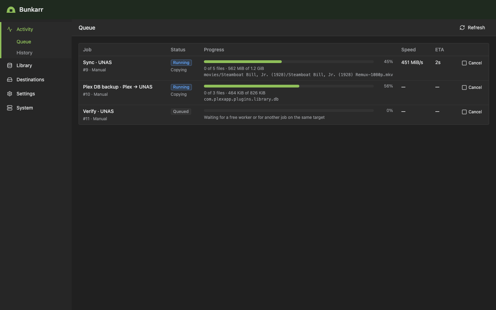</a>
      <p align="center"><b>Activity → Queue</b>: running jobs with progress, speed and the file being copied</p>
    </td>
    <td width="50%" valign="top">
      <a href="docs/images/history.png">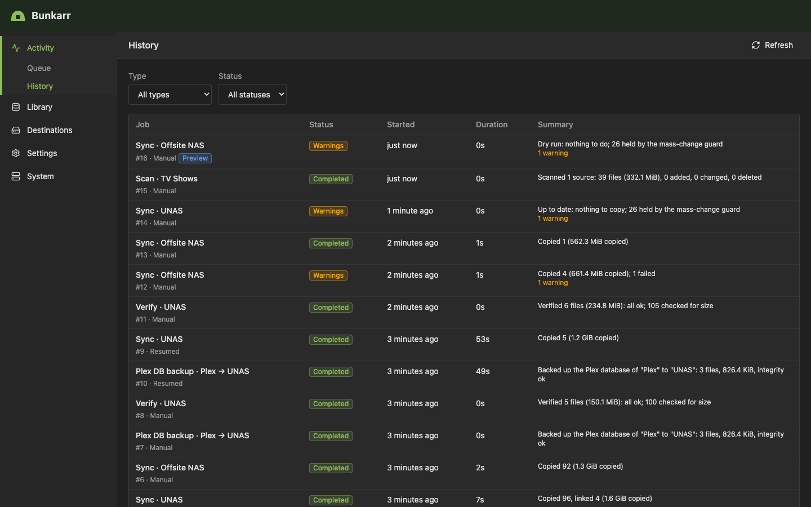</a>
      <p align="center"><b>Activity → History</b>: every scan, preview, sync, verify and Plex DB backup, with warnings and resumed jobs</p>
    </td>
  </tr>
  <tr>
    <td width="50%" valign="top">
      <a href="docs/images/job.png">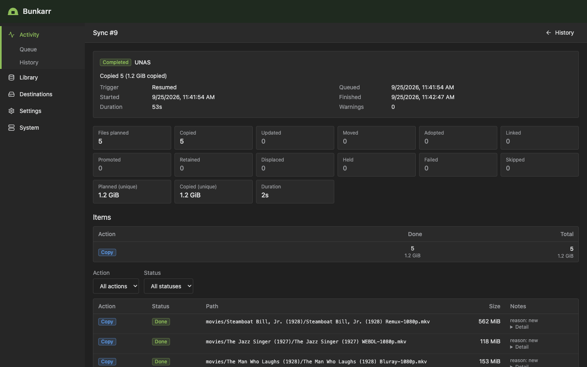</a>
      <p align="center"><b>Job detail</b>: what a sync did, file by file (this one resumed after a restart)</p>
    </td>
    <td width="50%" valign="top">
      <a href="docs/images/library.png">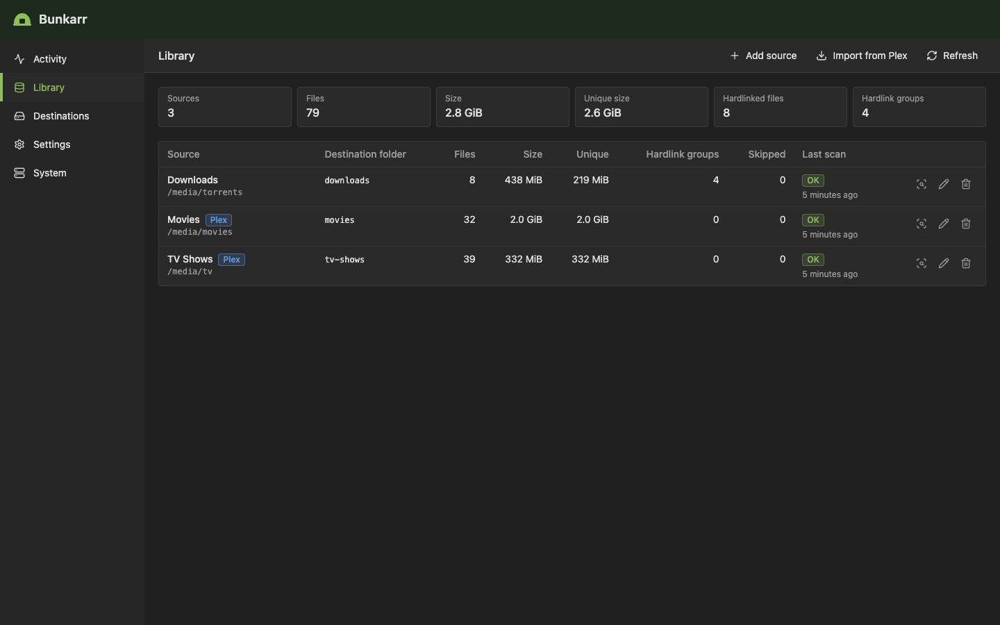</a>
      <p align="center"><b>Library</b>: sources imported from Plex or added by hand; hardlinks are counted once</p>
    </td>
  </tr>
  <tr>
    <td width="50%" valign="top">
      <a href="docs/images/destinations.png">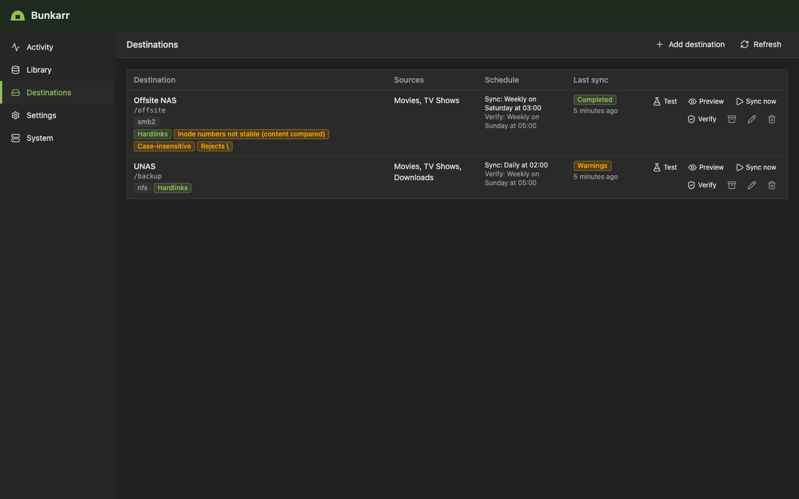</a>
      <p align="center"><b>Destinations</b>: each share with the capabilities Bunkarr probed, its schedules and last sync</p>
    </td>
    <td width="50%" valign="top">
      <a href="docs/images/destination-test.png">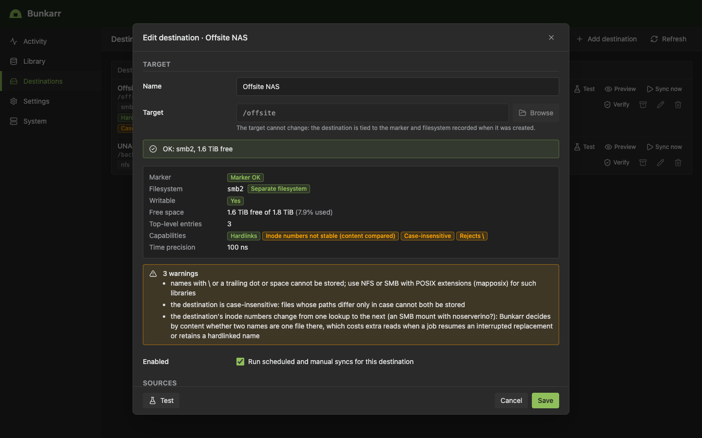</a>
      <p align="center"><b>Destination test</b>: what an SMB share can store, and what that means for your backup</p>
    </td>
  </tr>
  <tr>
    <td width="50%" valign="top">
      <a href="docs/images/plex.png">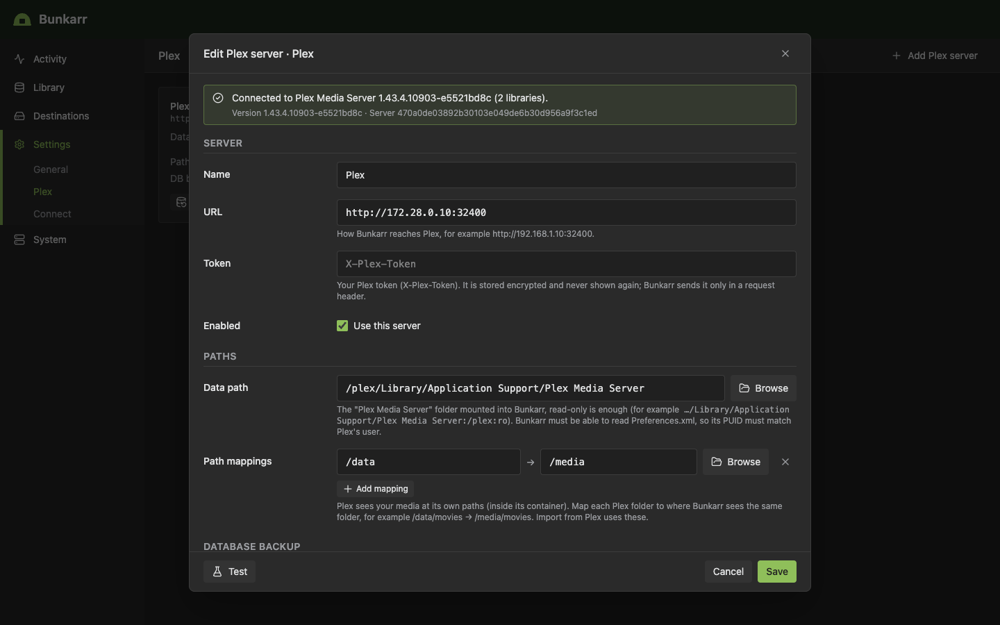</a>
      <p align="center"><b>Settings → Plex</b>: connection test, data path and path mappings</p>
    </td>
    <td width="50%" valign="top">
      <a href="docs/images/plex-snapshots.png">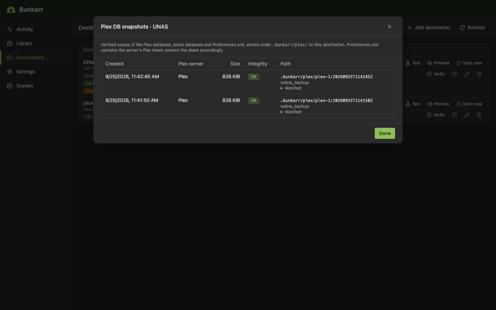</a>
      <p align="center"><b>Plex DB snapshots</b>: verified versions of the Plex database on the share</p>
    </td>
  </tr>
  <tr>
    <td width="50%" valign="top">
      <a href="docs/images/tasks.png">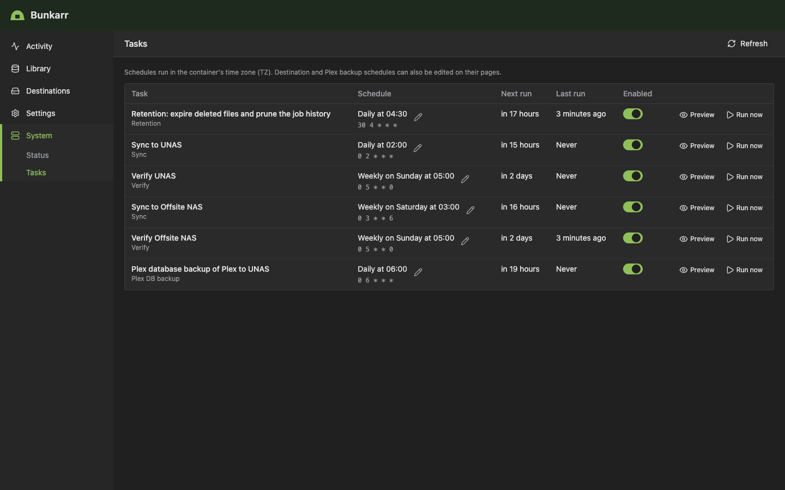</a>
      <p align="center"><b>System → Tasks</b>: every schedule, with Preview and Run now</p>
    </td>
    <td width="50%" valign="top">
      <a href="docs/images/status.png">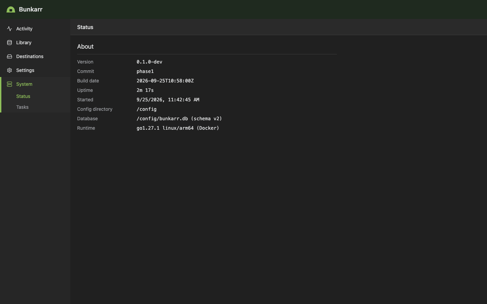</a>
      <p align="center"><b>System → Status</b>: version, build and where Bunkarr keeps its data</p>
    </td>
  </tr>
  <tr>
    <td colspan="2" align="center">
      <a href="docs/images/mobile.png">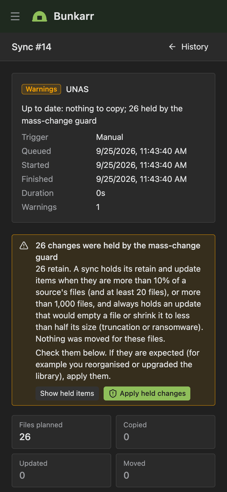</a>
      <p align="center"><b>Mobile</b>: a sync held by the mass-change guard, on a phone</p>
    </td>
  </tr>
</table>

## What it does today

- **Sources**: library folders, mounted read-only and never written to. Add them by hand or import
  them from Plex's libraries. Scans are incremental; hardlinked names within a source (for
  example cross-seeded torrents, or a download and its library copy when one source covers both
  folders) are detected, copied once and counted once. Hardlinks between two different sources
  are not matched yet, so such content is copied once per source.
- **Destinations**: a mounted folder, mirrored with the `filecopy` engine: one folder per source,
  every file written to a temp file, hashed, fsynced and renamed into place, hardlinks recreated
  where the share supports them.
- **Nothing is lost**: files deleted at the source and old versions of changed files move into
  `.bunkarr/retention/` and are kept 30 days (per destination). A file Bunkarr did not write is
  never overwritten or deleted. When a Radarr/Sonarr upgrade's new file cannot be backed up, the
  old version stays in the live backup until the new one is.
- **Hardlink manifest**: `.bunkarr/links.tsv` at each destination lists every hardlinked name
  and the file that holds its content, so a restore without Bunkarr can recreate them.
- **Guards**: a sync refuses to run when the share is not mounted (marker file and filesystem type
  are checked) or a source looks unmounted (missing, empty, another filesystem); the mass-change
  guard holds unusually large deletes and shrinking files for you to confirm.
- **Preview** (dry run) of every sync, and of every scheduled task in System → Tasks (e.g. which
  retained files the expiry would delete); **resume** after a crash or restart; weekly **verify**
  that re-reads a sample of the backup against the recorded hashes.
- **Plex database backup** while Plex runs: library database, blobs database and
  `Preferences.xml`, verified, versioned (14 daily + 8 weekly by default).
- **Adopts an existing rsync copy** instead of copying everything again.
- **Schedules** (System → Tasks), **Activity** (queue with progress and ETA, history, job logs) and
  **Apprise notifications**.

## Quick start (Docker Compose)

1. Get the compose file:

   ```sh
   git clone https://github.com/sl0wz3r/bunkarr.git
   cd bunkarr
   ```

2. **Before starting anything**, create `deploy/.env` with your paths and user. The values below
   are Unraid's; replace each with yours (the tables below explain them):

   ```sh
   PUID=99
   PGID=100
   TZ=America/New_York
   BUNKARR_CONFIG=/mnt/user/appdata/bunkarr
   MEDIA_DIR=/mnt/user/data
   PLEX_DIR="/mnt/user/appdata/plex/Library/Application Support/Plex Media Server"
   BACKUP_DIR=/mnt/remotes/UNAS_backup
   ```

   [`deploy/docker-compose.yml`](deploy/docker-compose.yml) refuses to start while `PUID`,
   `PGID`, `TZ`, `MEDIA_DIR`, `PLEX_DIR` or `BACKUP_DIR` is missing, so Docker never creates
   empty folders at guessed paths. `BUNKARR_CONFIG` defaults to `/mnt/user/appdata/bunkarr`. Not
   using the Plex DB backup? Delete the `/plex` line from the compose file. Git ignores `.env`;
   a variable set in your shell (often `TZ`) takes precedence over it.

3. Check what Compose will run, then start it:

   ```sh
   docker compose -f deploy/docker-compose.yml config   # shows the resolved mounts and variables
   docker compose -f deploy/docker-compose.yml up -d --build
   ```

4. Open `http://<host>:8787`. On first run Bunkarr asks you to create a username and password;
   the UI and API are closed until you do (the API key works from the start for automation).

| Mount (`.env` variable) | Purpose |
|---|---|
| `/config` (`BUNKARR_CONFIG`) | Bunkarr's database, `bunkarr.key`, logs, Plex DB staging (needs free space for one copy of the Plex database). Use an absolute appdata path outside the checkout (a folder in it would enter the image build context). **Back up `bunkarr.key` with the database**: stored credentials cannot be decrypted without it. |
| `/media` (`MEDIA_DIR`, `:ro`) | Your library. Mount the folder that holds both downloads and library (e.g. `/mnt/user/data`) as **one volume** so hardlinks are detected. |
| `/plex` (`PLEX_DIR`, `:ro`) | Plex's data directory, `…/appdata/plex/Library/Application Support/Plex Media Server`, for the Plex DB backup. Read-only is enough. |
| `/backup` (`BACKUP_DIR`, `:rw,slave`) | The destination, e.g. the UNAS share mounted on the host (`/mnt/remotes/…`). Unassigned Devices mounts remote shares after Docker starts; `slave` propagation lets the container see the share when it appears. Without it Bunkarr sees an empty folder (and refuses to sync). |

| Variable | Compose file | Image default | |
|---|---|---|---|
| `PUID` / `PGID` | required | `1000` / `1000` | User/group Bunkarr runs as. **Use the user Plex runs as** (Unraid: `99` / `100`): Plex keeps `Preferences.xml` at mode 0600. |
| `UMASK` | `022` | `002` | |
| `TZ` | required | `Etc/UTC` | e.g. `America/New_York`. Use Plex's time zone (the Plex backup checks Plex's maintenance hours in it). |
| `BUNKARR_PORT` | — | `8787` | Web UI and API port inside the container. |
| `BUNKARR_BIND` | — | all interfaces | Listen address. |
| `BUNKARR_LOG_LEVEL` | — | `info` | `debug`, `info`, `warn`, `error`. |
| `BUNKARR_LOG_FORMAT` | — | `text` | stdout format (`text` or `json`); `/config/logs/bunkarr.log` is always JSON. |

The example sets `stop_grace_period: 1m`: on a clean stop running jobs are queued to resume. A
killed container resumes its jobs as well, but a job killed three times in a row fails.

### Storage notes

- **Unraid `/mnt/user`** is a FUSE filesystem: its inode numbers identify hardlinks only when
  "Tunable (support Hard Links)" is on (Bunkarr then also compares the first and last MiB). A
  pool or disk path (`/mnt/cache/data`) avoids the question.
- **NFS is the recommended way to mount the UNAS share.** SMB without POSIX extensions is
  case-insensitive, rejects `\ : * ? " < > |` and names ending in a dot or space, and usually has
  no hardlinks. Bunkarr probes the share when you add it: files it cannot store fail with a
  warning (two names that differ only in case never overwrite each other) and everything else
  syncs. Mount SMB with POSIX extensions or the `mapposix` option to store such names. Such a
  share also ignores file modes, which matters for the Plex token in the Plex DB backup (see
  [Restoring](#restoring)).
- **SMB with `noserverino`** (Unraid's Unassigned Devices mounts shares so) numbers inodes per
  lookup: where the share has hardlinks, the names of one file show different inode numbers.
  The probe detects this (the destination test shows *Inode numbers not stable (content
  compared)*) and Bunkarr then decides by content whether two names are one file, which costs
  extra reads when a job resumes an interrupted replacement or retains a hardlinked name. Because
  a share can be remounted, or the CIFS client can turn server inode numbers off by itself, a
  sync, verify or retention job checks this again before it first compares two names (a few small
  files in `.bunkarr/probe`) and stores a change; a dry run does not write, so it just compares by
  content.
- A sync checks free space before copying (new data plus 1 GiB).

### Locked out?

```sh
docker exec -it bunkarr /entrypoint.sh reset-auth
```

This removes the login (not the API key or anything else); the next visit shows the first-run setup.

## First run

1. **Login.** Create the user on the first visit.
2. **Plex** (Settings → Plex, optional). Add the server:
   - URL: use the server's IP, `http://192.168.1.10:32400`. A claimed server with a token also
     works by container name; an unclaimed one answers 401 to a name it does not know.
   - Token: your `X-Plex-Token` (write-only; only ever sent to this URL).
   - Data path: `/plex`.
   - Path mappings: Plex's path → Bunkarr's path for the same folder, e.g. `/data` → `/media`.
   - Test.
3. **Sources** (Library). *Import from Plex* lists each library folder with its path as Bunkarr
   sees it, or *Add source* by hand. Each source is mirrored into its **destination folder**
   (default: the source name as a slug). Switching from rsync? Set the destination folder to the
   folder name your rsync job writes to. Scan.
4. **Destination** (Destinations → Add). Target `/backup` (or a folder inside it), **Test** (shows
   the filesystem, capabilities, free space and warnings), pick the sources, then save. Bunkarr
   writes `.bunkarr/destination.json` into the target; every job checks it, so an unmounted share
   is never mistaken for an empty backup.
5. **Adopt the existing rsync copy** (if you have one):
   - Disable the rsync job first.
   - In the destination form, keep *Adopt existing files* at "When size and modification time
     match" (rsync `-a` keeps modification times). If your copy did not keep them, choose "size and content hash" (reads
     both sides once). Set *Time window* to 1–2 s for FAT or older SMB servers.
   - Click **Preview**: the job's items should be mostly *adopt*, not *copy*. A file that does not
     match is moved into retention (never overwritten) and copied again.
   - Then **Sync now**. Adopted files are recorded without being copied.
6. **Schedules.** Choose the sync schedule in the destination form (it proposes nightly 02:00;
   no sync is scheduled until you save one). New destinations get a weekly verify (Sunday
   05:00). For the Plex DB backup, pick the destination in Settings → Plex (daily 06:00 by
   default, outside Plex's 02:00–05:00 maintenance window; the form warns on overlap). Expiry of
   retained files and old job history runs daily at 04:30. System → Tasks lists them all (edit,
   disable, Run now, **Preview**). Preview starts a dry run and opens it: for the expiry task it
   queues one dry run per destination, whose items are the retained files a real run would delete
   (the global job's log links them). Nothing is deleted, and a preview does not count as a run
   of the schedule. API: `POST /api/v1/schedules/{id}/run` with `{"dryRun": true}`.
7. **Notifications** (Settings → Connect, optional): an Apprise API for failures and warnings.

## The mass-change guard

An unmounted share, a bad script or ransomware looks to a backup like "delete or rewrite
everything". Two guards stop that from reaching the backup:

- **Scans refuse** to change the catalog when a source root is missing, not a directory, on another
  filesystem than before, empty while files are catalogued, or returns I/O errors. The sync
  fails; nothing at the destination changes.
- **Large changes are held.** Before copying, each sync counts per source the files it would move
  into retention (deleted at the source) or replace (changed). Above 10 % of the source's files
  *and* more than 20 files, or above 1000 files (both limits per destination: *Max changes*,
  *Max changed files*), those items are **held**: nothing is moved or replaced, new files still
  sync, the job ends *completed with warnings* and a warning notification is sent. A change that
  would leave a file empty or less than half its backed-up size is always held.

To apply held changes that you expected, open the job (Activity) and click **Apply held changes**.
It starts a sync with `allowChanges`, which runs them; the API equivalent is
`POST /api/v1/destinations/{id}/sync` with `{"allowChanges": true}`. Deleted and replaced files
still go to retention first. Preview shows what would be held.

## Restoring

- **Files** are plain copies under `<target>/<destination folder>/…`. Deleted files and older
  versions stay under `<target>/.bunkarr/retention/<time>-job<id>/…` until they expire. Copy them
  back with any tool (a restore wizard is Phase 5).
- **Hardlinked names.** Of a hardlink group (an *arr download and its library copy), the
  destination holds one file. Where the share supports hardlinks (and the destination's
  *Hardlinks* setting is "recreate") the other names are hardlinks of it; otherwise (SMB without
  Unix extensions, or "copy") they are only recorded and **have no file at the destination**.
  After every sync Bunkarr writes `<target>/.bunkarr/links.tsv`, one line per hardlinked name:

  ```
  <name> TAB <primary> TAB <state>
  ```

  Both paths are relative to `<target>`; `state` is `linked` (already a hardlink) or
  `link_recorded` (no file: recreate it). Lines starting with `#` are comments. In paths, `\\`,
  `\t`, `\n` and `\r` stand for a backslash, tab, newline and carriage return, and a leading `\#`
  for `#`. After copying the files back, recreate the recorded names from the restored copy
  (`$RESTORE` is where you restored `<target>`'s tree to; use `cp` instead of `ln` across
  filesystems):

  ```sh
  cd "$RESTORE"
  grep -v '^#' /path/to/target/.bunkarr/links.tsv | grep -v '\\' |
    while IFS="$(printf '\t')" read -r name primary state; do
      [ -e "$name" ] || { mkdir -p "$(dirname "$name")" && ln "$primary" "$name"; }
    done
  ```

  The loop skips lines with an escaped character (`grep -v '\\'`); recreate those by hand. Apart
  from Bunkarr's own database (which Phase 1 does not back up), the manifest is the only record
  of these names.
- **Plex database** versions are under `<target>/.bunkarr/plex/<server>-<id>/<time>/` with a
  `manifest.json` (sha256 of each file, integrity result). To restore:
  1. Stop Plex.
  2. Move aside `com.plexapp.plugins.library.db` and `com.plexapp.plugins.library.blobs.db` in
     `Plug-in Support/Databases/`, and delete their `-wal` and `-shm` files (a stale WAL would be
     replayed onto the restored database).
  3. Copy in the backup's database files, owned by Plex's user, mode 0644.
  4. Restore `Preferences.xml` only to the same server: it holds the server's identity and token.
  5. Start Plex.
- **`Preferences.xml` holds your Plex token in cleartext.** Every Plex DB version includes it,
  and it contains `PlexOnlineToken`, the server's authentication token for your Plex account.
  Bunkarr writes it with mode 0600, but an SMB share mounted without POSIX extensions takes file
  modes from its mount options (Unraid's Unassigned Devices uses `file_mode=0777`), so anyone who
  can read the share may be able to read the token. Restrict who can read the backup share (or
  its `.bunkarr/plex` folder) on the NAS, or mount it over NFS or SMB with Unix extensions. An
  option to skip or encrypt this file is planned ([DEFERRED.md](DEFERRED.md)).

## API

REST under `/api/v1`, JSON, *arr-style authentication: the API key from **Settings → General** in
the `X-Api-Key` header or the `apikey` query parameter.

```sh
curl -H "X-Api-Key: $KEY" http://localhost:8787/api/v1/system/status
curl -H "X-Api-Key: $KEY" -H 'Content-Type: application/json' -d '{"dryRun":true}' \
  http://localhost:8787/api/v1/destinations/1/sync   # preview a sync (202 + the job)
```

- `GET /api/v1/health` — unauthenticated liveness check.
- `GET /api/v1/openapi.json` — the OpenAPI 3.1 description of every endpoint (a test keeps it in
  step with the router). The Phase 1 contract is [`docs/design/phase1.md`](docs/design/phase1.md) §7.

## Roadmap

| Phase | |
|---|---|
| 0 | Foundation: server, auth, settings, UI shell, image, CI ✅ |
| 1 | MVP: Plex integration, scanner with hardlink detection, file-copy engine, scheduled syncs, Plex DB backup, activity/history, Apprise notifications ✅ |
| 2 | *arr awareness: Sonarr/Radarr APIs and webhooks, *arr config backups, manifest export |
| 3 | Tiering: rule engine (tags, quality, Tautulli, Seerr, Maintainerr), plan preview |
| 4 | Destinations & versioning: restic and rclone engines, B2/S3/SFTP, bandwidth windows |
| 5 | Restore & disaster recovery: restore wizard, manifest re-acquisition, restore tests |
| 6 | Release polish: Unraid CA template, metrics, notifications, docs site, hardening |

Decisions are recorded in [`docs/adr`](docs/adr); postponed items with reasons in
[`DEFERRED.md`](DEFERRED.md).

## Development

Requirements: Go 1.27, Node 24, make; Docker for the image tests.

```sh
make web build        # UI into web/dist, then bin/bunkarr embedding it
make run              # serve on :8787 with ./config
make test lint        # Go (race) + web tests; gofmt, vet, typecheck, shellcheck
make test-e2e         # acceptance suite against the real binary (syncs, hardlinks, kill -9 + resume, guards)
make docker-test      # build the image and smoke-test it
make test-docker      # image smoke, container kill, Plex backup/restore and SMB/NFS share tests (Docker and Go)
make test-plex        # the Plex backup/restore test only (slow; pulls plexinc/pms-docker once)
make test-shares      # syncs and kill + resume on Samba (CIFS) and NFS shares (privileged containers)
cd web && npm run dev # UI dev server on :5173, proxying /api to :8787
```

See [CONTRIBUTING.md](CONTRIBUTING.md).

## License

[GPL-3.0-or-later](LICENSE), like the *arr ecosystem.
