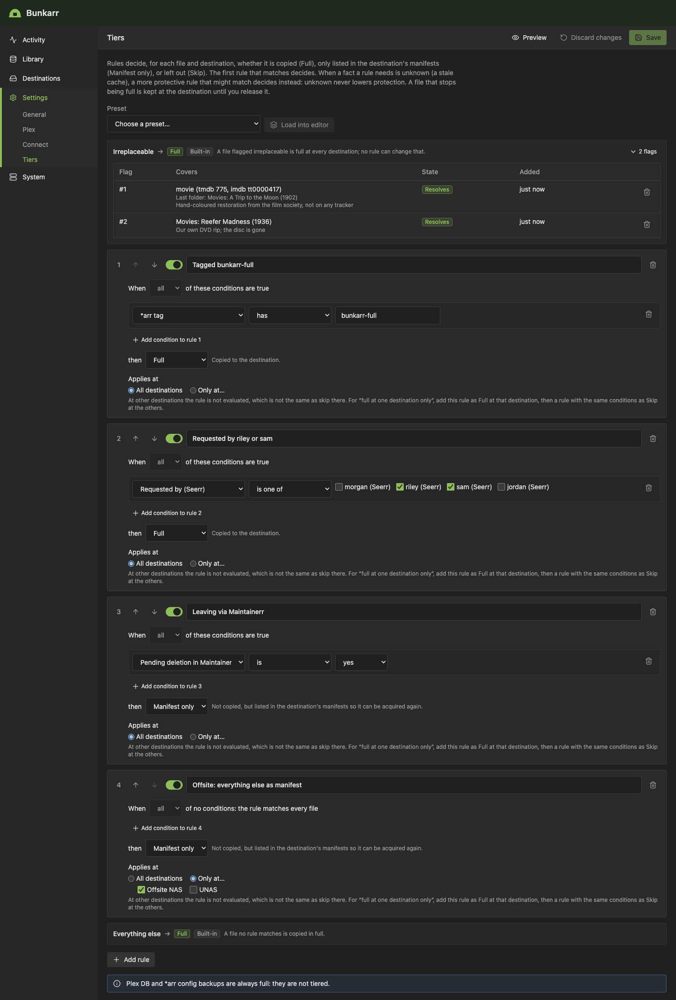
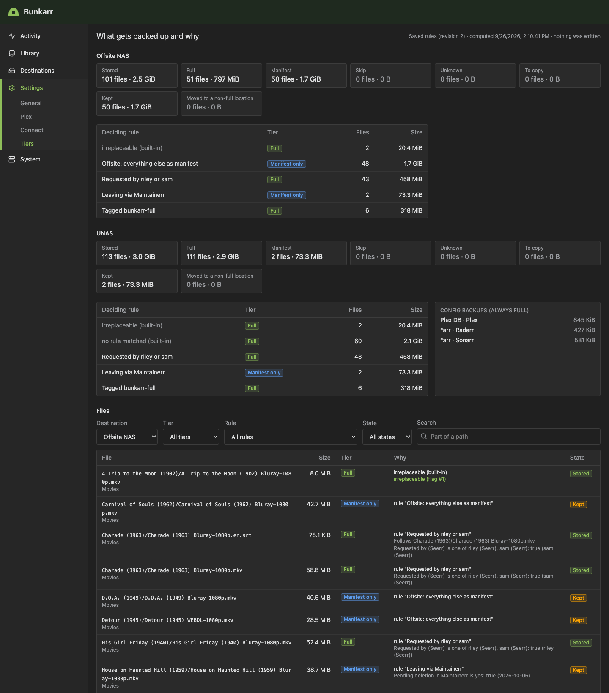
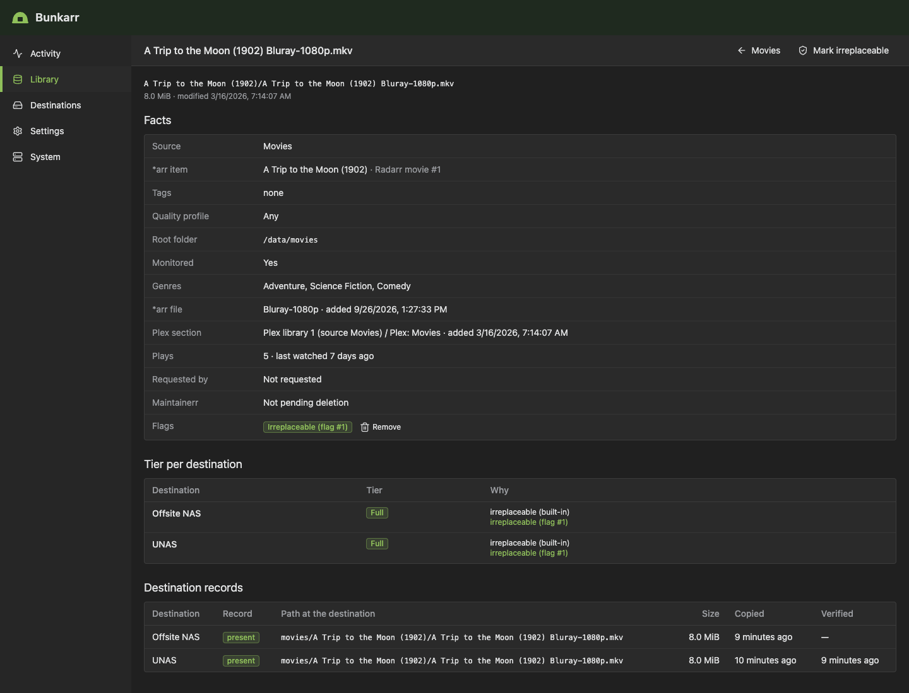
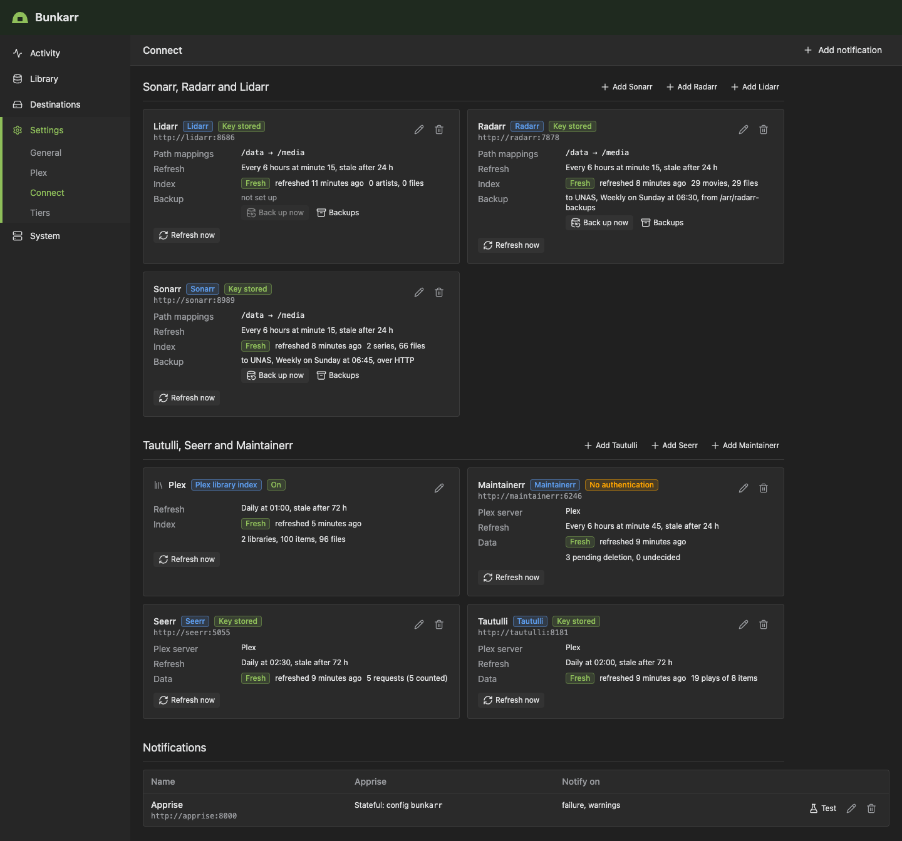
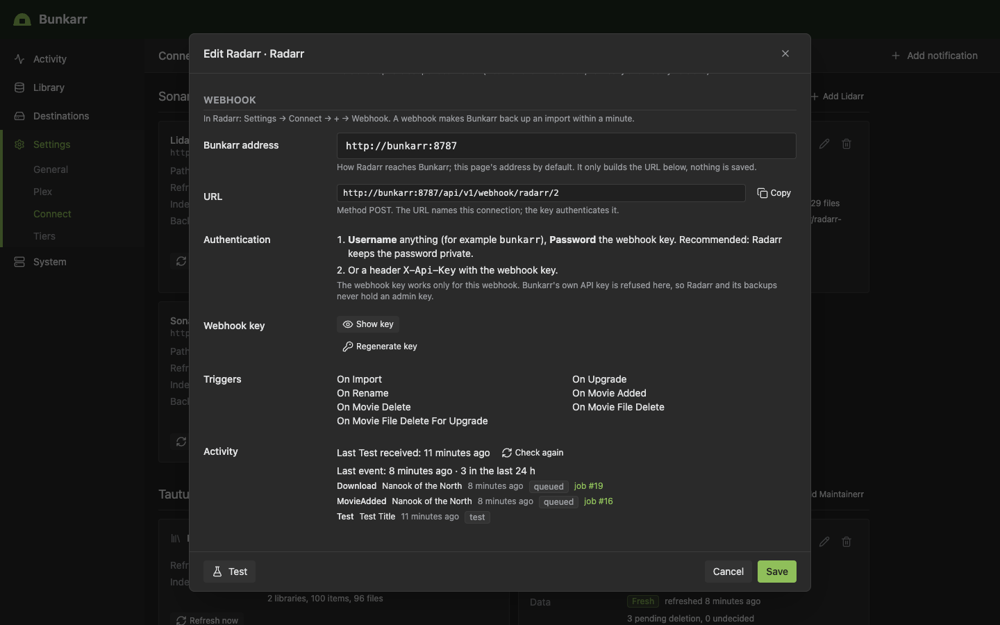
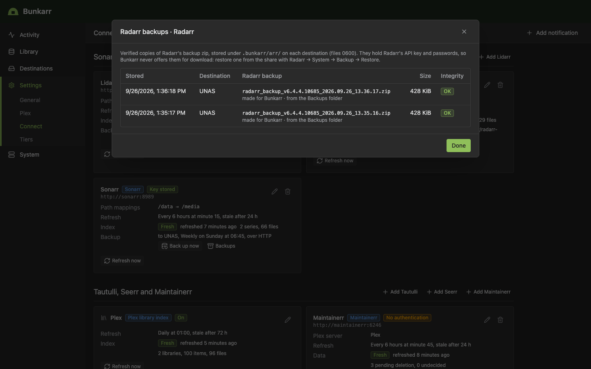
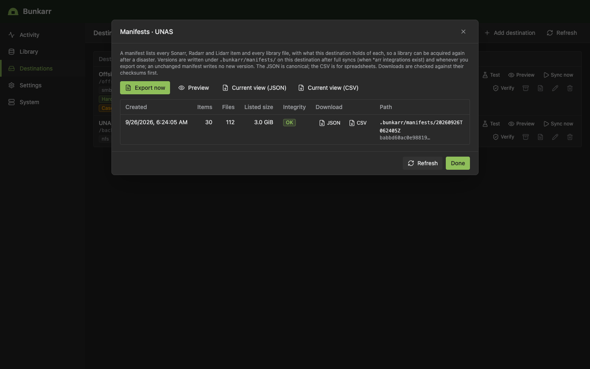
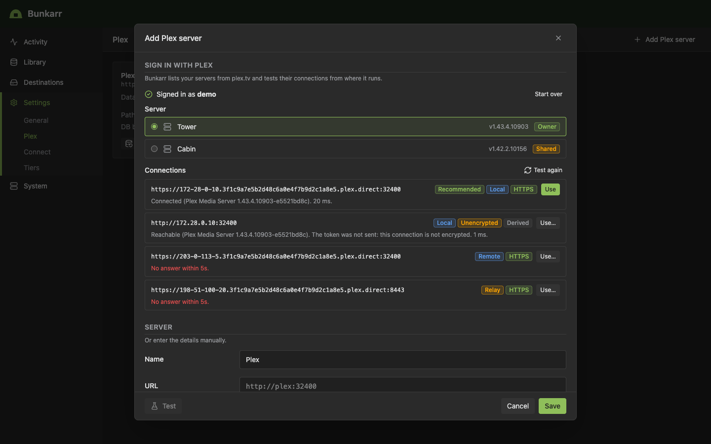

# Bunkarr

**Your library's bunker.** Bunkarr is a self-hosted, *arr-style backup app for Plex media libraries
and the *arr stack. It knows which media can be re-downloaded:

- **Irreplaceable data** (the Plex database, Sonarr/Radarr configuration and databases, personal
  media, rare content) gets **full, versioned backups**.
- **Common, easily re-acquired content** can get a **manifest-only backup** (TMDB/TVDB/IMDb IDs,
  quality profile, root folder, path), restorable by having Sonarr/Radarr download it again.
  Your [tier rules](#tiers) decide which content that is; until you add rules, everything is
  copied in full.

Bunkarr never modifies or deletes your source media.

> **Status: early development. Phase 3 (tiering) is complete; Phase 4 (restic, rclone and
> remote destinations) is next.** Bunkarr mirrors your libraries to a mounted share (such as a
> UniFi UNAS over NFS or SMB), backs up the Plex database and the Sonarr, Radarr and Lidarr
> configuration, backs up an *arr import within a minute through its webhook, and writes
> manifests of every *arr item. Tier rules decide, per destination, which files are copied in
> full and which are only listed in the manifests; with no rules (the default) every file is
> still copied in full. The restore wizard comes in Phase 5. See [the roadmap](#roadmap).

## Screenshots

The screenshots show a demo setup, not a real library: public-domain films and TV series as files
of random bytes, a scratch Plex Media Server and real Sonarr, Radarr and Lidarr in Docker (the
imports are tiny generated videos), and an NFS share ("UNAS") and an SMB share ("Offsite NAS")
served by containers. Tautulli, Seerr and Maintainerr are the fakes from the test suite, serving
their recorded answers with demo plays, requests and users; "Sign in with Plex" ran against a fake
plex.tv. No real media and no real account were involved.

<table>
  <tr>
    <td width="50%" valign="top">
      <a href="docs/images/queue.png"></a>
      <p align="center"><b>Activity → Queue</b>: running jobs with progress, speed and the file being copied</p>
    </td>
    <td width="50%" valign="top">
      <a href="docs/images/history.png"></a>
      <p align="center"><b>Activity → History</b>: webhook-triggered refreshes and targeted syncs next to a full sync, an *arr backup and a manifest export</p>
    </td>
  </tr>
  <tr>
    <td width="50%" valign="top">
      <a href="docs/images/job.png"></a>
      <p align="center"><b>Job detail</b>: a Radarr upgrade backed up by a webhook: the new file copied, the old one kept in retention</p>
    </td>
    <td width="50%" valign="top">
      <a href="docs/images/library.png"></a>
      <p align="center"><b>Library</b>: sources imported from Plex or added by hand; hardlinks are counted once</p>
    </td>
  </tr>
  <tr>
    <td width="50%" valign="top">
      <a href="docs/images/tiers.png"></a>
      <p align="center"><b>Settings → Tiers</b>: ordered rules per destination; irreplaceable flags always win, and a file no rule matches is copied in full</p>
    </td>
    <td width="50%" valign="top">
      <a href="docs/images/preview.png"></a>
      <p align="center"><b>Preview</b>: what each destination would copy, list or skip, in files and bytes, and why for every file</p>
    </td>
  </tr>
  <tr>
    <td width="50%" valign="top">
      <a href="docs/images/library-item.png"></a>
      <p align="center"><b>Library → a file</b>: the facts, flags and tier at each destination, and why</p>
    </td>
    <td width="50%" valign="top">
      <a href="docs/images/connect.png"></a>
      <p align="center"><b>Settings → Connect</b>: the *arrs with path mappings, index status and backups; Tautulli, Seerr and Maintainerr for the tier rules</p>
    </td>
  </tr>
  <tr>
    <td width="50%" valign="top">
      <a href="docs/images/webhook.png"></a>
      <p align="center"><b>Webhook</b>: the URL and key to paste into Radarr, and the events it sent</p>
    </td>
    <td width="50%" valign="top">
      <a href="docs/images/arr-backups.png"></a>
      <p align="center"><b>*arr backups</b>: verified copies of Radarr's own backup zip, never offered for download</p>
    </td>
  </tr>
  <tr>
    <td width="50%" valign="top">
      <a href="docs/images/manifests.png"></a>
      <p align="center"><b>Manifests</b>: every *arr item and library file, versioned on each destination</p>
    </td>
    <td width="50%" valign="top">
      <a href="docs/images/plex-signin.png"></a>
      <p align="center"><b>Sign in with Plex</b>: pick a server and one of its tested connections</p>
    </td>
  </tr>
  <tr>
    <td width="50%" valign="top">
      <a href="docs/images/plex.png"></a>
      <p align="center"><b>Settings → Plex</b>: connection test, sign-in or URL and token, data path</p>
    </td>
    <td width="50%" valign="top">
      <a href="docs/images/destinations.png"></a>
      <p align="center"><b>Destinations</b>: each share with the capabilities Bunkarr probed, its schedules and last sync</p>
    </td>
  </tr>
  <tr>
    <td width="50%" valign="top">
      <a href="docs/images/destination-test.png"></a>
      <p align="center"><b>Destination test</b>: what an SMB share can store, and what that means for your backup</p>
    </td>
    <td width="50%" valign="top">
      <a href="docs/images/plex-snapshots.png"></a>
      <p align="center"><b>Snapshots</b>: verified Plex DB and *arr backup versions on the share</p>
    </td>
  </tr>
  <tr>
    <td width="50%" valign="top">
      <a href="docs/images/tasks.png"></a>
      <p align="center"><b>System → Tasks</b>: every schedule, with Preview and Run now</p>
    </td>
    <td width="50%" valign="top">
      <a href="docs/images/status.png"></a>
      <p align="center"><b>System → Status</b>: version, build and where Bunkarr keeps its data</p>
    </td>
  </tr>
  <tr>
    <td colspan="2" valign="top" align="center">
      <a href="docs/images/mobile.png"></a>
      <p align="center"><b>Mobile</b>: a sync held by the mass-change guard, on a phone</p>
    </td>
  </tr>
</table>

## What it does today

- **Sources**: library folders, mounted read-only and never written to. Add them by hand or import
  them from Plex's libraries. Scans are incremental; hardlinked names within a source (for
  example cross-seeded torrents, or a download and its library copy when one source covers both
  folders) are detected, copied once and counted once. Hardlinks between two different sources
  are not matched yet, so such content is copied once per source.
- **Destinations**: a mounted folder, mirrored with the `filecopy` engine: one folder per source,
  every file written to a temp file, hashed, fsynced and renamed into place, hardlinks recreated
  where the share supports them.
- **Nothing is lost**: files deleted at the source and old versions of changed files move into
  `.bunkarr/retention/` and are kept 30 days (per destination). A file Bunkarr did not write is
  never overwritten or deleted. When a Radarr/Sonarr upgrade's new file cannot be backed up, the
  old version stays in the live backup until the new one is.
- **Hardlink manifest**: `.bunkarr/links.tsv` at each destination lists every hardlinked name
  and the file that holds its content, so a restore without Bunkarr can recreate them.
- **Guards**: a sync refuses to run when the share is not mounted (marker file and filesystem type
  are checked) or a source looks unmounted (missing, empty, another filesystem); the mass-change
  guard holds unusually large deletes and shrinking files for you to confirm.
- **Preview** (dry run) of every sync, and of every scheduled task in System → Tasks (e.g. which
  retained files the expiry would delete); **resume** after a crash or restart; weekly **verify**
  that re-reads a sample of the backup against the recorded hashes.
- **Plex database backup** while Plex runs: library database, blobs database and
  `Preferences.xml`, verified, versioned (14 daily + 8 weekly by default).
- **Adopts an existing rsync copy** instead of copying everything again.
- **Schedules** (System → Tasks), **Activity** (queue with progress and ETA, history, job logs) and
  **Apprise notifications**.
- **Sonarr, Radarr and Lidarr** (Settings → Connect): Bunkarr keeps an index of their movies,
  series, artists and files, refreshed every 6 hours and at start-up. Their **webhooks** make an
  import or upgrade reach the backup within a minute: the webhook only says which item changed,
  Bunkarr asks the *arr about it and syncs just that folder. The full refresh catches up on
  anything a webhook missed. See [Sonarr, Radarr and Lidarr](#sonarr-radarr-and-lidarr).
- ***arr config backups**: each app's own backup zip (settings and database), read from its
  `Backups` folder (or downloaded over HTTP), verified and versioned at a destination. See
  [*arr config backups](#arr-config-backups).
- **Manifests**: a JSON and CSV list of every *arr item and every file, with what each
  destination holds, written after full syncs and on demand, so a library can be acquired again
  after a disaster. See [Manifests](#manifests).
- **Sign in with Plex**: pick your server after a plex.tv sign-in instead of pasting a token.
  Tokens stay on Bunkarr's server.
- **Tiers** (Settings → Tiers): ordered rules decide, per destination, whether a file is copied
  in full, only listed in the manifests, or left out, from its *arr tags, quality profile, root
  folder, genre, Plex library, size, age, Tautulli plays, Seerr requests or Maintainerr's pending
  deletions. Presets, a preview of what each destination would hold, **irreplaceable** flags that
  no rule can override, and demoted files that stay backed up until you release them. See
  [Tiers](#tiers).
- **Tautulli, Seerr and Maintainerr** (Settings → Connect): read-only connections whose play
  history, requests and pending deletions become facts for the tier rules, matched to your
  files through the Plex server they are linked to. See
  [Tautulli, Seerr and Maintainerr](#tautulli-seerr-and-maintainerr).

## Quick start (Docker Compose)

1. Get the compose file:

   ```sh
   git clone https://github.com/sl0wz3r/bunkarr.git
   cd bunkarr
   ```

2. **Before starting anything**, create `deploy/.env` with your paths and user. The values below
   are Unraid's; replace each with yours (the tables below explain them):

   ```sh
   PUID=99
   PGID=100
   TZ=America/New_York
   BUNKARR_CONFIG=/mnt/user/appdata/bunkarr
   MEDIA_DIR=/mnt/user/data
   PLEX_DIR="/mnt/user/appdata/plex/Library/Application Support/Plex Media Server"
   BACKUP_DIR=/mnt/remotes/UNAS_backup
   # optional: the *arr apps' Backups folders (uncomment their lines in the compose file too)
   SONARR_BACKUPS=/mnt/user/appdata/sonarr/Backups
   RADARR_BACKUPS=/mnt/user/appdata/radarr/Backups
   LIDARR_BACKUPS=/mnt/user/appdata/lidarr/Backups
   ```

   [`deploy/docker-compose.yml`](deploy/docker-compose.yml) refuses to start while `PUID`,
   `PGID`, `TZ`, `MEDIA_DIR`, `PLEX_DIR` or `BACKUP_DIR` is missing, so Docker never creates
   empty folders at guessed paths. `BUNKARR_CONFIG` defaults to `/mnt/user/appdata/bunkarr`. Not
   using the Plex DB backup? Delete the `/plex` line from the compose file. Git ignores `.env`;
   a variable set in your shell (often `TZ`) takes precedence over it.

3. Check what Compose will run, then start it:

   ```sh
   docker compose -f deploy/docker-compose.yml config   # shows the resolved mounts and variables
   docker compose -f deploy/docker-compose.yml up -d --build
   ```

4. Open `http://<host>:8787`. On first run Bunkarr asks you to create a username and password;
   the UI and API are closed until you do (the API key works from the start for automation).

| Mount (`.env` variable) | Purpose |
|---|---|
| `/config` (`BUNKARR_CONFIG`) | Bunkarr's database, `bunkarr.key`, logs, Plex DB staging (needs free space for one copy of the Plex database). Use an absolute appdata path outside the checkout (a folder in it would enter the image build context). **Back up `bunkarr.key` with the database**: stored credentials cannot be decrypted without it. |
| `/media` (`MEDIA_DIR`, `:ro`) | Your library. Mount the folder that holds both downloads and library (e.g. `/mnt/user/data`) as **one volume** so hardlinks are detected. |
| `/plex` (`PLEX_DIR`, `:ro`) | Plex's data directory, `…/appdata/plex/Library/Application Support/Plex Media Server`, for the Plex DB backup. Read-only is enough. |
| `/backup` (`BACKUP_DIR`, `:rw,slave`) | The destination, e.g. the UNAS share mounted on the host (`/mnt/remotes/…`). Unassigned Devices mounts remote shares after Docker starts; `slave` propagation lets the container see the share when it appears. Without it Bunkarr sees an empty folder (and refuses to sync). |
| `/arr/<app>-backups` (`SONARR_BACKUPS`, `RADARR_BACKUPS`, `LIDARR_BACKUPS`, `:ro`; optional) | The `Backups` folder of each *arr you connect (its `/config/Backups`, e.g. `/mnt/user/appdata/radarr/Backups`), for the *arr config backups. The lines are commented out in the compose file: uncomment the ones you need. The folder must exist before the container starts; the app creates it with its first backup (System → Backup → Backup Now). See [*arr config backups](#arr-config-backups). |

| Variable | Compose file | Image default | |
|---|---|---|---|
| `PUID` / `PGID` | required | `1000` / `1000` | User/group Bunkarr runs as. **Use the user Plex runs as** (Unraid: `99` / `100`): Plex keeps `Preferences.xml` at mode 0600. |
| `UMASK` | `022` | `002` | |
| `TZ` | required | `Etc/UTC` | e.g. `America/New_York`. Use Plex's time zone (the Plex backup checks Plex's maintenance hours in it). |
| `BUNKARR_PORT` | — | `8787` | Web UI and API port inside the container. |
| `BUNKARR_BIND` | — | all interfaces | Listen address. |
| `BUNKARR_LOG_LEVEL` | — | `info` | `debug`, `info`, `warn`, `error`. |
| `BUNKARR_LOG_FORMAT` | — | `text` | stdout format (`text` or `json`); `/config/logs/bunkarr.log` is always JSON. |

The example sets `stop_grace_period: 1m`: on a clean stop running jobs are queued to resume. A
killed container resumes its jobs as well, but a job killed three times in a row fails.

### Storage notes

- **Unraid `/mnt/user`** is a FUSE filesystem: its inode numbers identify hardlinks only when
  "Tunable (support Hard Links)" is on (Bunkarr then also compares the first and last MiB). A
  pool or disk path (`/mnt/cache/data`) avoids the question.
- **NFS is the recommended way to mount the UNAS share.** SMB without POSIX extensions is
  case-insensitive, rejects `\ : * ? " < > |` and names ending in a dot or space, and usually has
  no hardlinks. Bunkarr probes the share when you add it: files it cannot store fail with a
  warning (two names that differ only in case never overwrite each other) and everything else
  syncs. Mount SMB with POSIX extensions or the `mapposix` option to store such names. Such a
  share also ignores file modes, which matters for the Plex token in the Plex DB backup (see
  [Restoring](#restoring)).
- **SMB with `noserverino`** (Unraid's Unassigned Devices mounts shares so) numbers inodes per
  lookup: where the share has hardlinks, the names of one file show different inode numbers.
  The probe detects this (the destination test shows *Inode numbers not stable (content
  compared)*) and Bunkarr then decides by content whether two names are one file, which costs
  extra reads when a job resumes an interrupted replacement or retains a hardlinked name. Because
  a share can be remounted, or the CIFS client can turn server inode numbers off by itself, a
  sync, verify or retention job checks this again before it first compares two names (a few small
  files in `.bunkarr/probe`) and stores a change; a dry run does not write, so it just compares by
  content.
- A sync checks free space before copying (new data plus 1 GiB).

### Locked out?

```sh
docker exec -it bunkarr /entrypoint.sh reset-auth
```

This removes the login (not the API key or anything else); the next visit shows the first-run setup.

## First run

1. **Login.** Create the user on the first visit.
2. **Plex** (Settings → Plex, optional). Add the server, either way:
   - **Sign in with Plex**: approve Bunkarr in the plex.tv window that opens, pick your server,
     and Bunkarr tests its connections (Local/Remote/Relay, HTTPS or Unencrypted) and recommends
     one. "Use" takes it; an unencrypted (`http`) or failing connection needs "Use anyway". See
     [Sign in with Plex](#sign-in-with-plex).
   - **Or enter the details manually**, as before:
     - URL: use the server's IP, `http://192.168.1.10:32400`. A claimed server with a token also
       works by container name; an unclaimed one answers 401 to a name it does not know.
     - Token: your `X-Plex-Token` (write-only; only ever sent to this URL).
   - Data path: `/plex`.
   - Path mappings: Plex's path → Bunkarr's path for the same folder, e.g. `/data` → `/media`.
   - Test.
3. **Sources** (Library). *Import from Plex* lists each library folder with its path as Bunkarr
   sees it, or *Add source* by hand. Each source is mirrored into its **destination folder**
   (default: the source name as a slug). Switching from rsync? Set the destination folder to the
   folder name your rsync job writes to. Scan.
4. **Destination** (Destinations → Add). Target `/backup` (or a folder inside it), **Test** (shows
   the filesystem, capabilities, free space and warnings), pick the sources, then save. Bunkarr
   writes `.bunkarr/destination.json` into the target; every job checks it, so an unmounted share
   is never mistaken for an empty backup.
5. **Adopt the existing rsync copy** (if you have one):
   - Disable the rsync job first.
   - In the destination form, keep *Adopt existing files* at "When size and modification time
     match" (rsync `-a` keeps modification times). If your copy did not keep them, choose "size and content hash" (reads
     both sides once). Set *Time window* to 1–2 s for FAT or older SMB servers.
   - Click **Preview**: the job's items should be mostly *adopt*, not *copy*. A file that does not
     match is moved into retention (never overwritten) and copied again.
   - Then **Sync now**. Adopted files are recorded without being copied.
6. **Schedules.** Choose the sync schedule in the destination form (it proposes nightly 02:00;
   no sync is scheduled until you save one). New destinations get a weekly verify (Sunday
   05:00). For the Plex DB backup, pick the destination in Settings → Plex (daily 06:00 by
   default, outside Plex's 02:00–05:00 maintenance window; the form warns on overlap). Expiry of
   retained files and old job history runs daily at 04:30. System → Tasks lists them all (edit,
   disable, Run now, **Preview**). Preview starts a dry run and opens it: for the expiry task it
   queues one dry run per destination, whose items are the retained files a real run would delete
   (the global job's log links them). Nothing is deleted, and a preview does not count as a run
   of the schedule. API: `POST /api/v1/schedules/{id}/run` with `{"dryRun": true}`.
7. **Sonarr, Radarr, Lidarr** (Settings → Connect, optional): connect each app, paste the
   webhook into it and, for its config backups, set its Backups folder. See
   [Sonarr, Radarr and Lidarr](#sonarr-radarr-and-lidarr).
8. **Notifications** (Settings → Connect, optional): an Apprise API for failures and warnings.

## Sonarr, Radarr and Lidarr

Settings → Connect → Sonarr, Radarr or Lidarr → **Add**. Bunkarr only reads from the apps (and
asks them to make their own backups); it never changes their settings, items or files.

### Connecting

- **URL**: how Bunkarr reaches the app, including any URL base: `http://192.168.1.10:7878`, or
  `http://radarr:7878/radarr` on the same Docker network (Sonarr's port is 8989, Lidarr's 8686).
- **API key**: the app's Settings → General → Security → API Key. Stored encrypted, never shown
  again, and sent only in a request header to this URL.
- **Path mappings**: the app reports paths as it sees them inside its container. Map each of its
  root folders to where Bunkarr sees the same folder. Both sides are the container paths of one
  host folder:

  | The app mounts | Its root folder | Bunkarr mounts | Mapping (app path → Bunkarr path) |
  |---|---|---|---|
  | `/mnt/user/data:/data` | `/data/media/movies` | `/mnt/user/data:/media` | `/data` → `/media` |
  | `/mnt/user/data/media/movies:/movies` | `/movies` | `/mnt/user/data:/media` | `/movies` → `/media/media/movies` |
  | `/mnt/user/data/media:/media` | `/media/movies` | `/mnt/user/data/media:/media` | `/media` → `/media` |

  A path no mapping covers is unmapped, so add a mapping even when both sides are the same. The
  mapped folder must be inside one of Bunkarr's sources (Library): Bunkarr backs up sources,
  and the app tells it which folder in them changed. An item whose folder is in no source is
  still indexed and listed in [manifests](#manifests), but nothing of it is copied.
- **Test** checks that the URL answers as the chosen app and accepts the key, then shows each
  root folder with its Bunkarr path and source, and backup access (see
  [*arr config backups](#arr-config-backups)). It also warns when:
  - the app's **recycle bin** lies inside a source that does not exclude it (every upgrade's old
    file would be copied twice; the warning offers to exclude it);
  - **Change File Date** is not None (every version of a title then gets the same modification
    time, so a replacement of the same size can look unchanged).
- The connection card shows the index (items, files, last refresh) and **Unmapped files**: files
  of the app that map to no path, lie in no source, or are not in the catalog yet (scan the
  source).
- **Full refresh**: every 6 hours (`15 */6 * * *`) and at start-up, Bunkarr reads all of the
  app's items and files, updates its index and queues a sync of each folder that changed. It
  catches up on everything a webhook missed.

### Webhook

After you save the connection, its **Webhook** panel shows what to paste into the app. In the
app: Settings → Connect → **+** → **Webhook**:

| App field | Value |
|---|---|
| Name | anything, e.g. `Bunkarr` |
| Triggers | the ones the panel lists (below) |
| Webhook URL | the panel's URL, `http://<bunkarr address>/api/v1/webhook/<app>/<id>`. The panel builds it from *Bunkarr address*, which is how the app reaches Bunkarr: `http://bunkarr:8787` on the same Docker network, otherwise the host's IP and port. |
| Method | `POST` |
| Username | anything, e.g. `bunkarr` |
| Password | the connection's **webhook key** (Show key) |

Then press **Test** in the app: the panel shows *Last Test received* and the recent events.

- **The webhook key belongs to this one connection.** It works only on its webhook route, and
  Bunkarr's own API key is refused there, so the app (and its backups, which hold its settings)
  never holds a key that controls Bunkarr. Basic auth (the key as the password) is recommended
  because the app keeps its password field private; the `X-Api-Key` header also works.
  `?apikey=<key>` in the URL works too but ends up in proxy and access logs. **Regenerate key**
  stops the old key at once: paste the new one into the app (events sent meanwhile are refused;
  the next full refresh catches up).
- **Triggers:**
  - Radarr: On Import, On Upgrade, On Rename, On Movie Added, On Movie Delete, On Movie File
    Delete, On Movie File Delete For Upgrade.
  - Sonarr: On Import, On Upgrade, On Rename, On Series Add, On Series Delete, On Episode File
    Delete, On Episode File Delete For Upgrade.
  - Lidarr: On Release Import, On Upgrade, On Rename, On Track Retag, On Artist Add, On Album
    Delete, On Artist Delete. Lidarr sends no webhook for a manual import unless "Replace
    existing files" is ticked, and none when a track file is deleted; the full refresh finds
    those changes.
- **What a webhook does.** It is a hint, not the truth: its payload only chooses which movie,
  series or artist to look at. Bunkarr waits 5 s for more events of the same item (at most 20 s),
  reads the item from the app's API, then scans and syncs just its folder. A delete waits 60 s,
  because the app sends it before it removes the folder; an upgrade's file delete waits for the
  import that follows it (up to 30 min), so the new file is copied before the old one moves into
  retention. A webhook sync moves a vanished file into retention only when its folder got new
  content (an upgrade or a rename); other deletions wait for the next full sync.
- **Webhooks can be missed** (Bunkarr stopped, a network error, an event type the app does not
  send). Nothing is lost: the full refresh and the scheduled syncs catch up.
- **How fast.** With a free worker and destination, an import starts copying within about 30 s
  of the app finishing it. What delays it, all common at night when the apps import:
  - a full refresh of the same connection (Sonarr needs two requests per series);
  - both job workers busy (for example a nightly sync and a weekly verify);
  - another destination's sync scanning the same source;
  - a sync, verify or retention job of the same destination (a verify of a large backup can take
    hours);
  - a file not yet visible through Bunkarr's mount (NFS attribute cache): up to 60 s more.

## *arr config backups

Each connection's **Backup** section copies the app's own backup zip (its settings and
database) to a destination, verifies it (zip structure, checksums, database integrity) and keeps
versions. Choose the destination to turn it on: it runs weekly (Sunday 06:30) by default, and
**Back up now** on the connection card runs it at once.

**Mount the app's Backups folder** (recommended). With a login required (Authentication: Forms,
the default), an *arr does not let its API key download backups, so Bunkarr reads the zips from
the folder instead. Bunkarr never stores the app's UI password.

1. Find the app's `Backups` folder on the host: its `/config/Backups`, on Unraid
   `/mnt/user/appdata/radarr/Backups`. The app creates it with its first backup (System → Backup
   → Backup Now).
2. Set the variable in `deploy/.env` and uncomment the app's line in
   [`deploy/docker-compose.yml`](deploy/docker-compose.yml) (read-only):

   ```yaml
   - "${RADARR_BACKUPS:?set RADARR_BACKUPS in deploy/.env (Radarr's Backups folder)}:/arr/radarr-backups:ro"
   ```

3. Recreate the container: `docker compose -f deploy/docker-compose.yml up -d`.
4. Settings → Connect → Radarr → Backup → **Backups folder** `/arr/radarr-backups`, then Test:
   *Backups folder: readable*. "Not readable" means the files are not readable by `PUID`.

Without a Backups folder Bunkarr downloads the zip over HTTP with the API key. That works only
when the app does not require a login for Bunkarr's address (Settings → General → Security →
Authentication Required: "Disabled for Local Addresses"); otherwise the job fails and says so.

- **Manual backups pile up in the app.** The apps prune only their scheduled backups (every
  7 days by default); a backup made on request is a manual one and stays in `Backups/manual`
  for good. So when the app's newest scheduled backup is younger than *Reuse scheduled backups*
  (7 days), Bunkarr copies it and asks for nothing; only otherwise does it ask the app for a new
  backup. Keep Bunkarr's schedule weekly. The card shows how many manual backups the app holds
  and warns above 10: delete old ones in the app (System → Backup).
- **The zips are sensitive.** They hold the app's API key and the passwords of its indexers and
  download clients. Bunkarr writes them with mode 0600 in 0700 folders, but does not encrypt
  them (a backup only Bunkarr's key could open would fail exactly when Bunkarr's config is
  lost). An SMB share mounted without POSIX extensions ignores file modes, so Bunkarr refuses
  such a destination unless you tick *Accept insecure file modes*. Restrict who can read the
  share, or its `.bunkarr/arr` folder, on the NAS.
- **Where:** `<target>/.bunkarr/arr/<connection>-<id>/<time>/`, the zip as the app made it and a
  `manifest.json` (its sha256, entries and integrity result). Versions kept: 14 daily and
  8 weekly (per destination: Destinations → Retention).
- **Restore:** in the app, System → Backup → Restore Backup, and upload the zip (the app
  restarts with that configuration and database).

## Manifests

A manifest is the disaster record of your *arr library: every Sonarr, Radarr and Lidarr item
(movies; series with their seasons and episodes; artists with their albums) with its IDs (TMDB,
TVDB, IMDb, MusicBrainz), title, year, quality profile, root folder, monitored state and tags,
and every file with its path, size and quality, plus its [tier](#tiers) at this destination and
whether this destination holds it (`backedUp`, `sha256`, or `kept` for a demoted file). Library
files that belong to no item are listed too (except `skip`-tier extras the destination does not
hold). With it, a library can be acquired again after a disaster, including anything that was
never copied.

- **Where:** `<target>/.bunkarr/manifests/<time>/`:
  - `manifest.json`, the canonical form;
  - `manifest.csv`, one row per file (and per item without files) for a spreadsheet; a cell that
    starts with `=`, `+`, `-` or `@` gets a leading `'`, so read the JSON when exact values
    matter;
  - `SHA256SUMS` for both.
- **When:** after each full sync (when *arr connections exist) and on **Export now**. An
  unchanged manifest writes no new version. Versions kept: the newest of each of the last
  30 days and 12 weeks (Destinations → Retention). A manifest ends *completed with warnings*
  when a connection's index is stale or an item's folder is in no source.
- **In the UI:** Destinations → the **Manifests** button of a destination lists its versions
  with their counts, downloads each as JSON or CSV (checked against its checksums first; a
  damaged one is reported, not downloaded), and has **Export now**, **Preview** and *Current
  view* (built on the spot). Library → **Export manifest** builds one of every enabled source,
  without the per-destination fields.
- **API:** `GET /api/v1/manifest/export?format=json|csv[&destinationId=N]` (built on the spot;
  the `X-Bunkarr-SHA256` header carries its hash), `GET /api/v1/destinations/{id}/manifests` and
  `GET /api/v1/manifests/{id}/download?format=json|csv`.
- **Without Bunkarr:** check a version, then query it, for example every item with a file the
  destination does not hold (kind, title, year, IDs):

  ```sh
  cd /path/to/target/.bunkarr/manifests/<time>
  sha256sum -c SHA256SUMS
  jq -r '.items[] | select(any((.files // [])[]; .backedUp == false))
         | [.kind, .title, .year, (.externalIds | tojson)] | @tsv' manifest.json
  ```

  A tool that adds the items back to a fresh *arr is part of the Phase 5 restore wizard; until
  then the manifest gives each item's IDs, root folder, quality profile and monitored state to
  add it by hand.

## Tiers

Settings → Tiers decides, for each file and each destination, one of three **tiers**:

- **Full**: copied, versioned and kept in retention, as in every earlier phase.
- **Manifest only**: not copied, but listed in that destination's [manifests](#manifests) so it
  can be acquired again.
- **Skip**: not copied. A file of an *arr item is still listed under its item; other skipped
  files (extras, files outside any item) are only counted.

**The default is full.** With no rules, every file is copied in full to every destination, exactly
as before Phase 3. Plex DB and *arr config backups are always full: they are not tiered.

**Rules.** A rule has a name, conditions, a match mode (*all* or *any*), an action (a tier) and
*Applies at*: all destinations or the ones you pick. At a destination, the enabled rules that
apply there are taken in order and **the first one that matches decides**; a file no rule matches
is full (the built-in *Everything else*). A rule not applied at a destination is simply not
evaluated there, which is not the same as *skip*: "full at the UNAS only" is one rule *full* at
the UNAS plus a second rule with the same conditions, *skip* at the other shares. Up to 100 rules
of up to 32 conditions each.

| Condition | From |
|---|---|
| *arr tag, quality profile, root folder, monitored; managed by an *arr | Sonarr, Radarr, Lidarr |
| Genre | the *arr item |
| Plex library | the source's Plex library, or the Plex library index |
| Source, file size, added (days) | Bunkarr's catalog (the *arr's or Plex's date added first) |
| Play count, last watched | Tautulli |
| Requested, requested by | Seerr (users by id only) |
| Pending deletion | Maintainerr |
| Flagged irreplaceable | your flags (below) |

- **Unknown never lowers protection.** A condition whose facts are unknown (a stale cache, two
  *arrs claiming the file, a file Plex has not indexed yet) is neither true nor false. When an
  earlier, more protective rule might have matched, it decides instead (*full* > *manifest
  only* > *skip*), and the file is shown as *unknown*. Copies that are full only because of an
  unknown fact count toward the [mass-change guard](#the-mass-change-guard), so a stale Radarr
  cannot flood a destination, and they never fail a sync for lack of free space: they are held
  instead.
- A file outside every *arr root folder (home videos, a Plex-only source), while the *arr
  caches are fresh, is **not managed**: its *arr conditions are false, not unknown.
- **Sidecars** (`.srt`, `.nfo`) follow their media file; the names of a **hardlink** group all
  take the most protective tier among them.

**Presets** (the *Preset* menu, then **Load into editor**) only fill the editor; nothing changes
until you Preview and Save:

- **Back up everything**: no rules (the default).
- **Manifest by default** (opt-in; the original spec's default): media tagged `bunkarr-full` in
  Sonarr, Radarr or Lidarr is full, everything else manifest only. This **stops copying new
  untagged media**, and a file outside every *arr root folder becomes manifest only too; a file
  whose *arr facts are unknown stays full. Tag what you want copied before you save it.
- **Keep Maintainerr deletions as manifest only**: what Maintainerr is about to delete is not
  copied but stays listed. Maintainerr has no authentication, so this preset never skips.

**Preview** evaluates the rules in the editor, saved or not, over every file of every enabled
destination, and shows per destination what is *stored* now, what would be full, manifest only
and skip, what is full only because a fact is unknown, what the next sync would *copy*, and what
would be *kept*, with counts per rule, the caches that are not fresh and any rule value (a tag, a
profile) that no index knows. Each file lists the reasons for its tier. Nothing is written.
**Save** takes effect at each destination's next sync; a save based on rules someone else changed
meanwhile is refused. Library → a file shows its tier at each destination and why.

**When a file stops being full** (a rule changed, a tag was removed), nothing is deleted: the
copy the destination holds is **kept**, and syncs leave it alone. Settings → Tiers then offers
**Release N files at <destination>…**. A release first runs a preview (a dry run) listing the kept
files it would free; on that job's page, **Apply release** moves exactly those files into the
destination's retention folder, where they expire after the retention period (30 days by
default). Files that are full again, or a preview made before the rules changed again, are not
released. A kept file that is deleted at the source, or replaced by a file of another name (an
upgrade), goes into retention as usual; the new file is copied only when its tier is full.

**Irreplaceable.** Library → a file → **Mark irreplaceable** flags the file's *arr item (by
default, when it has one: the flag follows the item across *arrs by its TMDB, TVDB or
MusicBrainz ID, and falls back to its last folder when the item is removed), the file, or its
folder (flags follow renames). A flagged file is full at every destination whatever the rules
say, and its retained copies never expire while the flag exists. Settings → Tiers →
*Irreplaceable* → *Flags* lists every flag and whether it still resolves.

## Tautulli, Seerr and Maintainerr

Settings → Connect → **Tautulli, Seerr and Maintainerr**. Bunkarr only **reads** from them, with
a fixed list of requests, and turns what it reads into facts for the [tier rules](#tiers):

| App | Version | Reads | Linked Plex server | Refresh (stale after) |
|---|---|---|---|---|
| Tautulli | ≥ 2.18 | play history per library: play count, last watched | required: the server it watches (the Test checks it) | daily 02:00 (72 h) |
| Seerr | ≥ 3 (Overseerr, Jellyseerr best effort) | requests (movie, series, seasons) and requesting user ids; no names or e-mail addresses | optional: used when a file has no TMDB or TVDB ID | daily 02:30 (72 h) |
| Maintainerr | ≥ 3.4 | the collections' items that are pending deletion | required: the server it manages | every 6 h (24 h) |

- **API keys** are write-only: Tautulli (Settings → Web Interface → API key) and Seerr (Settings →
  General → API Key). Maintainerr has **no API authentication**: anyone who can reach it can add
  items to a deleting collection, so rely on its facts with care and keep it off untrusted
  networks.
- **Plex server scoping.** Tautulli's plays and Maintainerr's collections name Plex items, and a
  Plex rating key only means something on its own server. Each connection is therefore linked to
  one Plex server, and its facts are matched to your files only through **that server's library
  index**, never another's. Linking a server offers to turn its index on (daily at 01:00, stale
  after 72 h; Settings → Connect shows it next to the connections). The index also serves the *Plex
  library* condition and Plex's added dates.
- **Freshness.** A connection whose last complete refresh is older than its *stale after* hours
  (or whose linked Plex index is stale) makes its conditions unknown, which never lowers
  protection. **Refresh now** on each card refreshes it at once.
- **Tautulli history turned off** for a user or a library (Tautulli's *Keep history*) makes play
  counts there a lower bound: "played more than N" can still be true, but "played fewer than N"
  and "never watched" become unknown. The Connect card says how many users and libraries this
  affects.

## Sign in with Plex

Settings → Plex → **Sign in with Plex**, instead of pasting a token:

1. A plex.tv window opens: sign in there and approve Bunkarr (Bunkarr never sees your password).
2. Pick your server. Bunkarr tests each connection plex.tv lists for it, from where Bunkarr runs,
   and adds a plain `http://<ip>:32400` for each local `*.plex.direct` address (many routers'
   DNS-rebind protection blocks those names). Working connections come first: local, then
   remote, relays last; HTTPS before HTTP.
3. **Use** takes the recommended connection; an unencrypted (`http`) or failing one needs
   **Use anyway**. Save.

- **Tokens stay on Bunkarr's server.** The browser never receives your account token or a server
  token. Bunkarr saves the server's own access token (encrypted) and sends a token only to a
  connection that answered as your server, and only over HTTPS until you choose *Use anyway*.
- If plex.tv lists no token for a server you own, Bunkarr can save your **account token** for it
  (tick *Use my Plex account token*). That token controls your whole Plex account and stays valid
  until you sign out of all devices.
- **A server shared with you** can be used to import libraries, but Bunkarr cannot read its
  settings (no maintenance-window check), and backing up its database needs its data folder
  mounted into Bunkarr. If plex.tv lists no token for it, Bunkarr never sends your account token
  to it: enter the server's URL and a token manually.
- **Network:** Bunkarr calls plex.tv and clients.plex.tv (HTTPS) only while you sign in; otherwise
  it talks only to your server's URL. A sign-in lasts 10 minutes and does not survive a restart.
- **Revoking:** Bunkarr appears on plex.tv under Settings → **Authorized Devices** as *Bunkarr*
  on *Docker* (each install has its own client identifier). Remove it there to revoke the
  sign-in; afterwards sign in again or enter a token manually.
- Entering the URL and token manually works as before (see [First run](#first-run)).

## Upgrading and downgrading

Update the checkout (`git pull`) and run the Quick start's `up -d --build` again, or pull a
released image (`docker compose -f deploy/docker-compose.yml pull`, then `up -d`). Running jobs
are queued to resume.

**Pre-migration copy.** Before a new version changes the database schema, Bunkarr writes a copy
of the database to `/config/backups/bunkarr-v<old schema version>-<time>.db` (mode 0600; the new
copy and the newest two others are kept), and it refuses to upgrade when that copy fails. Phase
2's upgrade rebuilds tables, and an older Bunkarr refuses a newer database, so this copy is the
only way back. To downgrade:

1. Stop Bunkarr: `docker compose -f deploy/docker-compose.yml down`.
2. In `/config`, move `bunkarr.db` and its `bunkarr.db-wal` and `bunkarr.db-shm` files (if
   present) aside.
3. Copy the pre-migration copy to `/config/bunkarr.db`, owned by `PUID`:`PGID`. Keep
   `bunkarr.key`: it is the same key.
4. Start the previous version: set `image:` to its tag, or check out its git tag and build.

Whatever Bunkarr recorded after the upgrade (jobs, backup versions, settings) is not in the copy.

## The mass-change guard

An unmounted share, a bad script or ransomware looks to a backup like "delete or rewrite
everything". Two guards stop that from reaching the backup:

- **Scans refuse** to change the catalog when a source root is missing, not a directory, on another
  filesystem than before, empty while files are catalogued, or returns I/O errors. The sync
  fails; nothing at the destination changes.
- **Large changes are held.** Before copying, each sync counts per source the files it would move
  into retention (deleted at the source) or replace (changed). Above 10 % of the source's files
  *and* more than 20 files, or above 1000 files (both limits per destination: *Max changes*,
  *Max changed files*), those items are **held**: nothing is moved or replaced, new files still
  sync, the job ends *completed with warnings* and a warning notification is sent. A change that
  would leave a file empty or less than half its backed-up size is always held.
- **Tiers count too.** Released files (see [Tiers](#tiers)) count as changes, like deletions, and
  so do new copies that are full only because a tier fact is unknown (for example Radarr's cache
  is stale). Above the limits those copies are held ("tier unknown because … is not fresh").

To apply held changes that you expected, open the job (Activity) and click **Apply held changes**.
It starts a sync with `allowChanges`, which runs them; the API equivalent is
`POST /api/v1/destinations/{id}/sync` with `{"allowChanges": true}`. Deleted and replaced files
still go to retention first. Preview shows what would be held.

## Restoring

- **Files** are plain copies under `<target>/<destination folder>/…`. Deleted files and older
  versions stay under `<target>/.bunkarr/retention/<time>-job<id>/…` until they expire. Copy them
  back with any tool (a restore wizard is Phase 5).
- **Hardlinked names.** Of a hardlink group (an *arr download and its library copy), the
  destination holds one file. Where the share supports hardlinks (and the destination's
  *Hardlinks* setting is "recreate") the other names are hardlinks of it; otherwise (SMB without
  Unix extensions, or "copy") they are only recorded and **have no file at the destination**.
  After every sync Bunkarr writes `<target>/.bunkarr/links.tsv`, one line per hardlinked name:

  ```
  <name> TAB <primary> TAB <state>
  ```

  Both paths are relative to `<target>`; `state` is `linked` (already a hardlink) or
  `link_recorded` (no file: recreate it). Lines starting with `#` are comments. In paths, `\\`,
  `\t`, `\n` and `\r` stand for a backslash, tab, newline and carriage return, and a leading `\#`
  for `#`. After copying the files back, recreate the recorded names from the restored copy
  (`$RESTORE` is where you restored `<target>`'s tree to; use `cp` instead of `ln` across
  filesystems):

  ```sh
  cd "$RESTORE"
  grep -v '^#' /path/to/target/.bunkarr/links.tsv | grep -v '\\' |
    while IFS="$(printf '\t')" read -r name primary state; do
      [ -e "$name" ] || { mkdir -p "$(dirname "$name")" && ln "$primary" "$name"; }
    done
  ```

  The loop skips lines with an escaped character (`grep -v '\\'`); recreate those by hand. Apart
  from Bunkarr's own database (which Bunkarr does not back up), the manifest is the only record
  of these names.
- **Plex database** versions are under `<target>/.bunkarr/plex/<server>-<id>/<time>/` with a
  `manifest.json` (sha256 of each file, integrity result). To restore:
  1. Stop Plex.
  2. Move aside `com.plexapp.plugins.library.db` and `com.plexapp.plugins.library.blobs.db` in
     `Plug-in Support/Databases/`, and delete their `-wal` and `-shm` files (a stale WAL would be
     replayed onto the restored database).
  3. Copy in the backup's database files, owned by Plex's user, mode 0644.
  4. Restore `Preferences.xml` only to the same server: it holds the server's identity and token.
  5. Start Plex.
- **`Preferences.xml` holds your Plex token in cleartext.** Every Plex DB version includes it,
  and it contains `PlexOnlineToken`, the server's authentication token for your Plex account.
  Bunkarr writes it with mode 0600, but an SMB share mounted without POSIX extensions takes file
  modes from its mount options (Unraid's Unassigned Devices uses `file_mode=0777`), so anyone who
  can read the share may be able to read the token. Restrict who can read the backup share (or
  its `.bunkarr/plex` folder) on the NAS, or mount it over NFS or SMB with Unix extensions. An
  option to skip or encrypt this file is planned ([DEFERRED.md](DEFERRED.md)).
- **Sonarr, Radarr and Lidarr configuration**: each version's zip under
  `<target>/.bunkarr/arr/…`; restore it in the app (see [*arr config backups](#arr-config-backups)).
  The same caution applies: the zips hold the app's API key and passwords.
- **The *arr library itself** (to acquire media again): the newest version under
  `<target>/.bunkarr/manifests/` (see [Manifests](#manifests)).

## API

REST under `/api/v1`, JSON, *arr-style authentication: the API key from **Settings → General** in
the `X-Api-Key` header or the `apikey` query parameter.

```sh
curl -H "X-Api-Key: $KEY" http://localhost:8787/api/v1/system/status
curl -H "X-Api-Key: $KEY" -H 'Content-Type: application/json' -d '{"dryRun":true}' \
  http://localhost:8787/api/v1/destinations/1/sync   # preview a sync (202 + the job)
```

- `GET /api/v1/health` — unauthenticated liveness check.
- `GET /api/v1/openapi.json` — the OpenAPI 3.1 description of every endpoint (a test keeps it in
  step with the router). The Phase 1 contract is [`docs/design/phase1.md`](docs/design/phase1.md) §7;
  Phase 2's and Phase 3's additions are in [`docs/design/phase2-3.md`](docs/design/phase2-3.md)
  §13.
- `/api/v1/tiers/…` — the tier rules (`GET`/`PUT /tiers/rules`, with the revision a save is
  based on), `GET /tiers/fields`, `GET /tiers/presets`, `POST /tiers/preview` (and
  `GET /tiers/preview/{id}/items`) and the irreplaceable flags (`/tiers/flags`). A release is a
  sync with `releaseDemoted` (see the OpenAPI description).
- `POST /api/v1/webhook/{app}/{integrationId}` — the *arr webhooks. They take only that
  connection's webhook key (Basic auth password, `X-Api-Key` or `apikey`), never the API key
  above; see [Webhook](#webhook).

## Roadmap

| Phase | |
|---|---|
| 0 | Foundation: server, auth, settings, UI shell, image, CI ✅ |
| 1 | MVP: Plex integration, scanner with hardlink detection, file-copy engine, scheduled syncs, Plex DB backup, activity/history, Apprise notifications ✅ |
| 2 | *arr awareness: Sonarr/Radarr/Lidarr APIs and webhooks, *arr config backups, manifest export, Sign in with Plex ✅ |
| 3 | Tiering: rule engine (tags, quality, Plex libraries, Tautulli, Seerr, Maintainerr), presets, preview, release of demoted files, irreplaceable flags ✅ |
| 4 | Destinations & versioning: restic and rclone engines, B2/S3/SFTP, bandwidth windows |
| 5 | Restore & disaster recovery: restore wizard, manifest re-acquisition, restore tests |
| 6 | Release polish: Unraid CA template, metrics, notifications, docs site, hardening |

Decisions are recorded in [`docs/adr`](docs/adr); postponed items with reasons in
[`DEFERRED.md`](DEFERRED.md).

## Development

Requirements: Go 1.27, Node 24, make; Docker for the image tests.

```sh
make web build        # UI into web/dist, then bin/bunkarr embedding it
make run              # serve on :8787 with ./config
make test lint        # Go (race) + web tests; gofmt, vet, typecheck, shellcheck
make test-e2e         # acceptance suite against the real binary (syncs, hardlinks, kill -9 + resume, guards)
make docker-test      # build the image and smoke-test it
make test-docker      # image smoke, container kill, Plex backup/restore and SMB/NFS share tests (Docker and Go)
make test-plex        # the Plex backup/restore test only (slow; pulls plexinc/pms-docker once)
make test-shares      # syncs and kill + resume on Samba (CIFS) and NFS shares (privileged containers)
make test-arr         # real Sonarr, Radarr and Lidarr: imports, upgrades, webhooks, backups, manifests, tiers (needs internet)
cd web && npm run dev # UI dev server on :5173, proxying /api to :8787
```

See [CONTRIBUTING.md](CONTRIBUTING.md).

## License

[GPL-3.0-or-later](LICENSE), like the *arr ecosystem.
